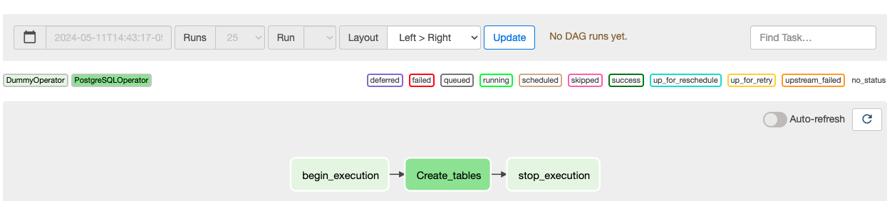
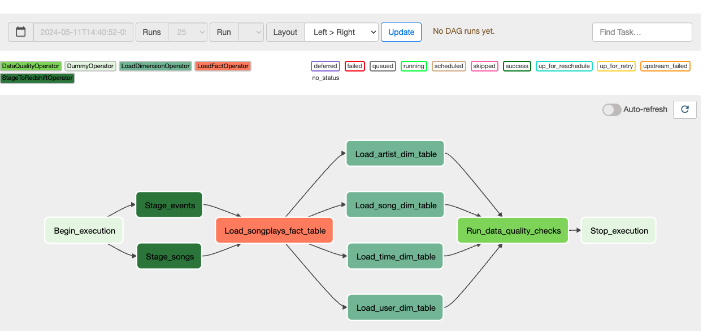

# AutomateDataPipelines

This repo contains the requirements for Project 4 - Data Pipelines with Airflow from the Udacity Data Engineering with AWS Nanodregee.

## To execute
1. Create S3 bucket and copy data from source
2. Set Up AWS and Airflow Configurations
3. Trigger create_tables DAG to create tables in Redshift
4. Trigger final_project DAG to run ETL data pipeline

To test the pipeline, set start_date = datetime(2018, 11, 1) and end_date = datetime(2018, 11, 2).

# Project Introduction
A music streaming company, Sparkify, has decided that it is time to introduce more automation and monitoring to their data warehouse ETL pipelines and come to the conclusion that the best tool to achieve this is Apache Airflow.

They have decided to bring you into the project and expect you to create high grade data pipelines that are dynamic and built from reusable tasks, can be monitored, and allow easy backfills. They have also noted that the data quality plays a big part when analyses are executed on top the data warehouse and want to run tests against their datasets after the ETL steps have been executed to catch any discrepancies in the datasets.

The source data resides in S3 and needs to be processed in Sparkify's data warehouse in Amazon Redshift. The source datasets consist of JSON logs that tell about user activity in the application and JSON metadata about the songs the users listen to.

## Datasets
- Log data: `s3://udacity-dend/log_data`
- Song data: `s3://udacity-dend/song_data`

## Tools 
- Python, SQL
- Apache Airflow
- Amazon Web Services (AWS IAM, S3, Redshift Serverless, CLI, Cloudshell

```
airflow users create --email student@example.com --firstname aStudent --lastname aStudent --password admin --role Admin --username admin
```

# Data Pipeline
## Copy S3 Data
```
# Create bucket
aws s3 mb s3://annarans/

#Copy Data
aws s3 cp s3://udacity-dend/log-data/ ~/log-data/ --recursive
aws s3 cp s3://udacity-dend/song-data/ ~/song-data/ --recursive
aws s3 cp s3://udacity-dend/log_json_path.json ~/

#Copy the data from the udacity bucket to the home cloudshell directory:

aws s3 cp ~/log-data/ s3://annarans/log-data/ --recursive
aws s3 cp ~/song-data/ s3://annarans/song-data/ --recursive
aws s3 cp ~/log_json_path.json s3://annarans/

#List the data in bucket to be sure it copied over:

aws s3 ls s3://annarans/log-data/
aws s3 ls s3://annarans/song-data/
aws s3 ls s3://annarans/log_json_path.json
```

## Configure AWS & Airflow
1. **IAM User Creation**

- Attach exiting policies:
    - Administrator Access
    - AmazonRedshiftFullAccess
    - AmazonS3Full Access

2. **Configure AWS Redshift Serverless**

- Create a Redshift Role `my-redshift-service-role` from the AWS Cloudshell.
- Give the role S3 Full Access

```
aws iam attach-role-policy --policy-arn arn:aws:iam::aws:policy/AmazonS3FullAccess --role-name my-redshift-service-role
```

- Setup AWS Redshift Serverless (Copy and store the Redshift Workgroup endpoint locally, which is required for Redshift connection in Airflow)


3. **Configure Connections in Airflow**

    - Add Airflow Connections:
        1. Connection ID: aws_credentails, Connetion Type: Amazon Web Services
        2. Connection ID: redshift, Connetion Type: Amazon Redshift

4. **Configure Variables in Airflow UI - S3 Paths**

```
Key = s3_bucket
Value = annarans
```

## Configure Airflow DAGs

<p align="center">
  
</p>

In the DAG, add default parameters according to these guidelines

- The DAG does not have dependencies on past runs
- On failure, the task are retried 3 times
- Retries happen every 5 minutes
- Catchup is turned off
- Do not email on retry
- In addition, configure the task dependencies so that after the dependencies are set, the graph view follows the flow shown in the image below.

1. `create_tables` 

<p align="center">
  
</p>

**Operators:**
1. begin_execution: DAG start
2. create_tables: Create tables in Redshift
3. stop_execution: DAG stop

2. `final_project`

<p align="center">
  
</p>

**Operators:**
1. begin_execution: DAG start
2. Staging Data
    - stage_events
    - stage_songs
3. load_songplays_fact_tables
4. Dim Tables
    - load_artist_dim_table
    - load_song_dim_table
    - load_time_dim_table
    - load_user_dim_table
5. run_data_quality_checks 
6. stop_execution: DAG stop
